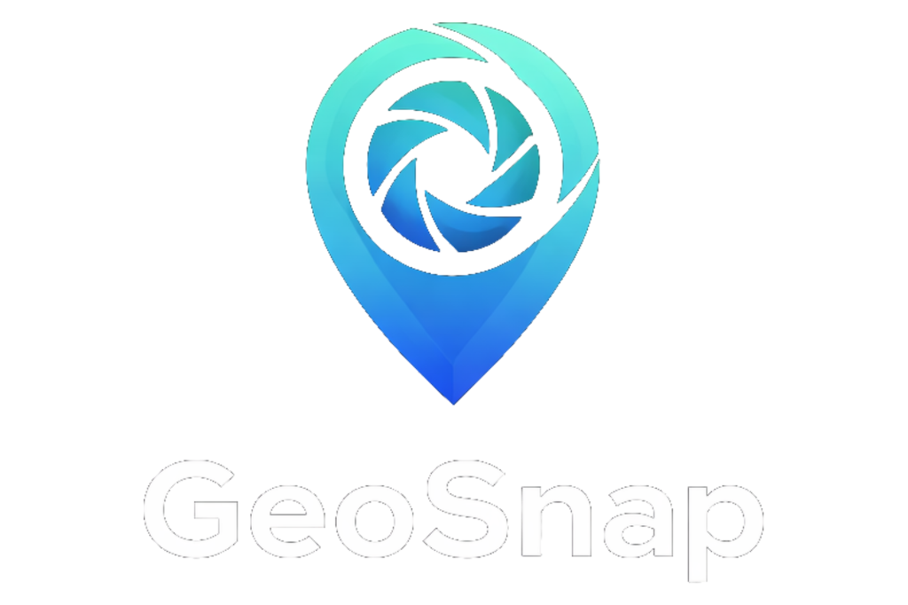

<div align="center">
  
  
  <p align="center">
    <strong>🔍 Discover where your photos were taken</strong>
  </p>
  
  <p align="center">
    A privacy-first photo location finder that extracts GPS coordinates and metadata from your images — entirely in your browser.
  </p>

  <p align="center">
    <a href="https://sathvik-nagesh.github.io/GeoSnap">
      
    </a>
  </p>

  <p align="center">
    
    
    
    
    
  </p>
</div>

---

## ✨ Features

### 📍 **EXIF Location Extraction**

Upload any photo and instantly extract embedded GPS coordinates, date/time, and camera metadata — all processed locally in your browser.

### 🤖 **AI-Powered Location Guessing**

No GPS data? No problem! Use Google's Gemini AI to analyze visual cues and estimate where the photo was taken.

### 🔒 **Privacy First**

Your images never leave your device for EXIF extraction. AI analysis is opt-in and uses Google's secure API.

### 🗺️ **Interactive Map**

View detected locations on a beautiful dark-themed interactive map with custom markers and Google Maps integration.

### 🧹 **EXIF Stripper Tool**

Remove all metadata from your photos before sharing — strip GPS, camera info, timestamps, and more.

### 🔗 **Drag from Browser**

Drag images directly from other browser tabs or websites to analyze them instantly.

### 📋 **Copy Coordinates**

One-click copy of coordinates to your clipboard for easy sharing.

---

## 🚀 Quick Start

### Prerequisites

- Node.js 18+
- npm or yarn

### Installation

```bash
# Clone the repository
git clone https://github.com/Sathvik-Nagesh/GeoSnap.git
cd GeoSnap

# Install dependencies
npm install

# Set up environment variables
cp .env.example .env.local
# Add your Gemini API key to .env.local

# Start development server
npm run dev
```

### Environment Variables

Create a `.env.local` file with:

```env
VITE_GEMINI_API_KEY=your_gemini_api_key_here
```

Get your free Gemini API key at [Google AI Studio](https://aistudio.google.com/app/apikey).

---

## 🛠️ Tech Stack

| Technology        | Purpose               |
| ----------------- | --------------------- |
| **React 19**      | UI Framework          |
| **TypeScript**    | Type Safety           |
| **Vite**          | Build Tool            |
| **Tailwind CSS**  | Styling               |
| **Framer Motion** | Animations            |
| **Leaflet**       | Interactive Maps      |
| **exifr**         | EXIF Metadata Parsing |
| **Gemini AI**     | Location Guessing     |

---

## 📸 Screenshots

<div align="center">
  <table>
    <tr>
      <td align="center">
        <strong>🏠 Landing Page</strong><br/>
        <sub>Premium dark theme with animated gradients</sub>
      </td>
      <td align="center">
        <strong>📍 Location Results</strong><br/>
        <sub>Interactive map with detailed metadata</sub>
      </td>
    </tr>
    <tr>
      <td align="center">
        <strong>🤖 AI Analysis</strong><br/>
        <sub>AI-powered location guessing</sub>
      </td>
      <td align="center">
        <strong>🧹 EXIF Stripper</strong><br/>
        <sub>Remove metadata before sharing</sub>
      </td>
    </tr>
  </table>
</div>

---

## 🔐 Privacy & Security

GeoSnap is built with privacy as a core principle:

| Feature               | Privacy Level                                                |
| --------------------- | ------------------------------------------------------------ |
| **EXIF Extraction**   | 🟢 100% Local — Images never leave your browser              |
| **AI Location Guess** | 🟡 Opt-in — Only sent to Google's Gemini API when you choose |
| **EXIF Stripper**     | 🟢 100% Local — Processed entirely in your browser           |
| **No Analytics**      | 🟢 We don't track you                                        |
| **No Storage**        | 🟢 No images or data are stored on any server                |

---

## 📦 Building for Production

```bash
# Build for production
npm run build

# Preview production build
npm run preview
```

---

## 🌐 Deployment

This project is configured for GitHub Pages deployment.

### Automatic Deployment

Push to the `main` branch to trigger automatic deployment via GitHub Actions.

### Manual Deployment

```bash
npm run build
# Deploy the 'dist' folder to your hosting provider
```

---

## 🤝 Contributing

Contributions are welcome! Feel free to:

1. Fork the repository
2. Create a feature branch (`git checkout -b feature/amazing-feature`)
3. Commit your changes (`git commit -m 'Add amazing feature'`)
4. Push to the branch (`git push origin feature/amazing-feature`)
5. Open a Pull Request

---

## 📄 License

This project is open source and available under the [MIT License](LICENSE).

---

## 👨‍💻 Author

**Sathvik Nagesh**

- GitHub: [@Sathvik-Nagesh](https://github.com/Sathvik-Nagesh)

---

<div align="center">
  <p>
    <sub>Built with ♥️ using React, Tailwind CSS, and Sathvik Nagesh</sub>
  </p>
  <p>
    <a href="https://sathvik-nagesh.github.io/GeoSnap">
      
    </a>
  </p>
</div>
